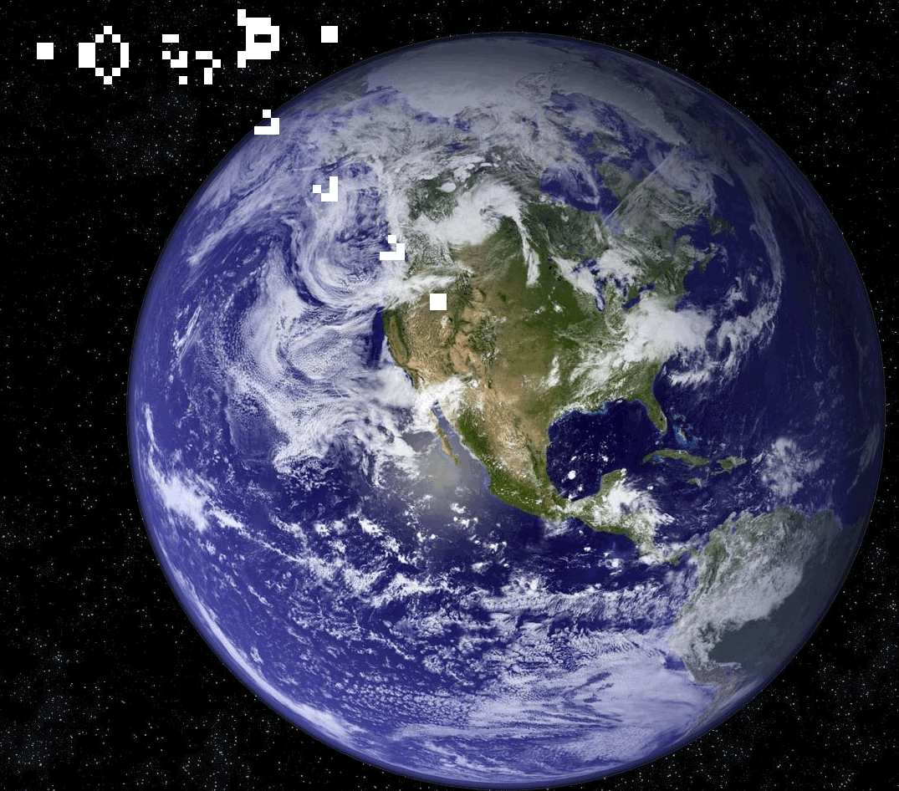

# Game of Life

An elixir implementation of [Conway's game of life](https://en.wikipedia.org/wiki/Conway%27s_Game_of_Life)

## Introduction

Game of life is a zero player game which has four rules:

- Any live cell with fewer than two live neighbours dies, as if caused by under-population.
- Any live cell with two or three live neighbours lives on to the next generation.
- Any live cell with more than three live neighbours dies, as if by over-population.
- Any dead cell with exactly three live neighbours becomes a live cell, as if by reproduction.

Given these simple rules, a cell world will automatically evolve to a different world, and sometimes some life behaviours are shown, such as repeat, moving.
This phenomena make it a fascinating game from a observer's perspective.

## Why choose elixir

I had chosen elixir to write this game mainly for purpose of learning this new language. But from some point of view it's a very good fit for this game:

- The game is all about data transition, in a massive scale where parallism can go pretty useful
- The elixir lang's pipe operator(|>) make the process very beautiful
- The elixir lang enforced the separation of concerns which make it natural to get Engine/WebUI out of surface
- The required supervision tree design phase make this game very stable

## How to run this game

### Using Docker

- `docker run -d -p 4000:4000 benb88/game_of_life`
- open [Demo](http://localhost:4000) page to view the game

### Manual

- Install [Elixir](http://elixir-lang.org/install.html)
- Install [Nodejs](https://nodejs.org/en/download/)
- `mix deps.get`
- `mix phoenix.server`
- open [Demo](http://localhost:4000) page to view the game
